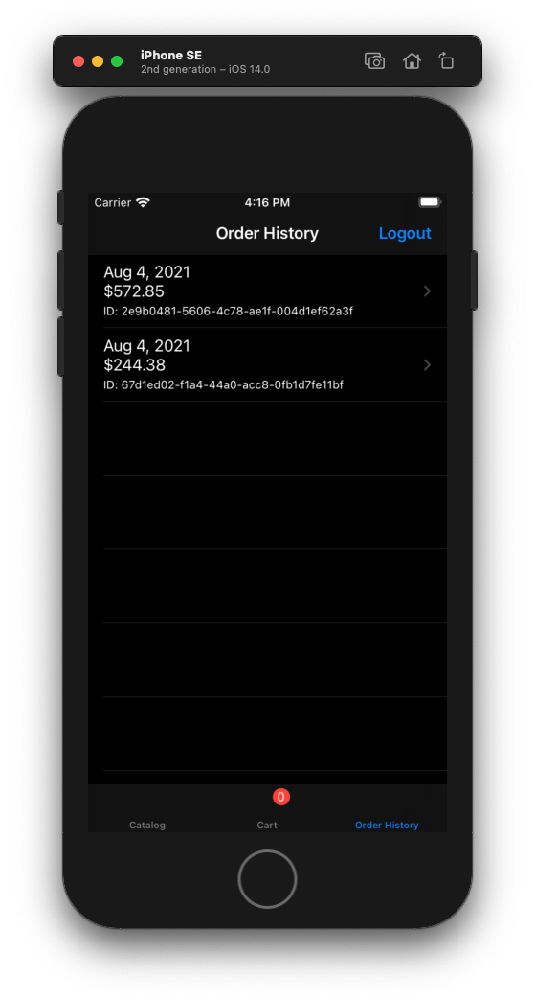
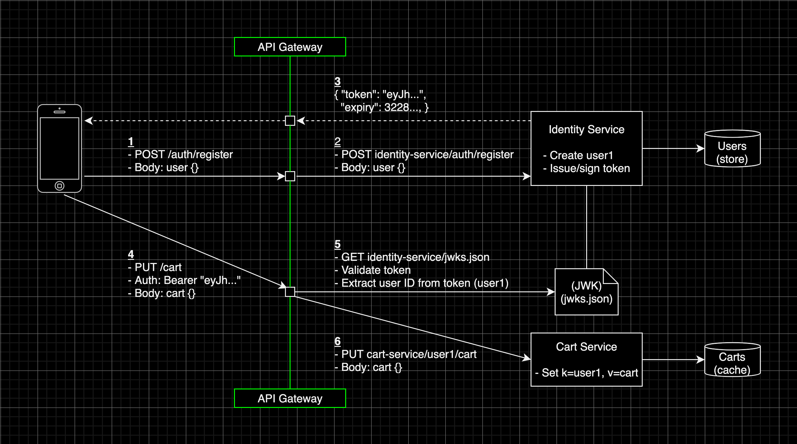
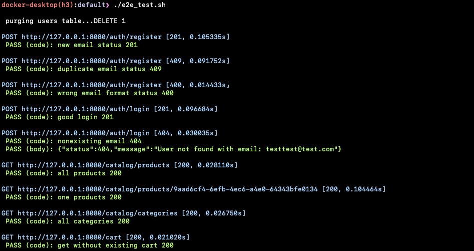

# Polyglot Sample Microservices Application


| Products | Cart | Orders |
| ------------ | ------------|  ------------|
  |  | 

Simplified cloud-native ecommerce application hosted on Kubernetes, allowing users to browse products and submit orders through an iOS frontend. The goal of the project is to experiment with languages, frameworks and architectures

<!-- TABLE OF CONTENTS -->
<details open="open">
  <summary>Table of Contents</summary>
  <ol>
    <li><a href="#architecture">Architecture</a></li>
    <li><a href="#getting-started">Getting Started</a></li>
    <li><a href="#roadmap">Roadmap</a></li>
    <li><a href="#contact">Contact</a></li>
  </ol>
</details>

## Architecture
###### System


| Service                                    | Language    | Description                                                  |
| ------------------------------------------ | ----------- | ------------------------------------------------------------ |
| [frontend-ios](./src/frontend-ios)         | Swift       | Mobile UI                                                    |
| [gateway](./src/gateway)                   | Helm / Yaml | API Gateway that forwards clients to the micro-services, handles JWT validation, terminates tls and transforms url paths |
| [identity-service](./src/identity-service) | Typescript  | Manages customer accounts and signs JWTs (symmetric HMAC), while hosting a JSON Web Key set (JWK) to offload authorization |
| [catalog-service](./src/catalog-service)   | Java        | Manages a catalog of products and categories |
| [cart-service](./src/cart-service)         | Go          | Manages shopping carts for **registered** customers |
| [order-service](./src/order-service)       | Typescript  | Manages **complete** orders for **registered** customers based on shopping carts |
| [payment-service](./src/payment-service)   | Go          | Manages payments based on orders from **registered** customers, offloading payment processing to the Stripe payment gateway |
| [load-generator](./src/load-generator)     | Python      | Generates artificial load using Python config files |

###### Authentication


###### Frontend iOS


###### Technologies
Ops
* Docker
* Kubernetes
* Helm
* Skaffold
* Prometheus
* Grafana
* Locust

Dev
* iOS (with RxSwift)
* Nodejs Express
* Go net/http (vanilla Go)
* Java Springboot 
* Postgresql (relational database)
* Redis (cache)
* Minio (S3)

## Getting Started
### Prerequisites
* [Docker](https://www.docker.com/)
* [Skaffold](https://skaffold.dev/) (Kubernetes only)

### Deploy
###### Kubernetes Local Docker Desktop
> Ensure Docker and Skaffold are installed

1. Enable Kubernetes on [Docker Desktop](https://docs.docker.com/docker-for-mac/#kubernetes)
2. Clone this repository
```sh
git clone git@github.com:Bajocode/polyglot-microservices-webshop.git
cd polyglot-microservices-webshop
```
3. Deploy
```sh
# The user value forwards skaffold.yaml defined services (the gateway :8080)
skaffold run --port-forward=user --tail
```
wait and verify all helmcharts have been deployed
```
kubectl get pods

NAME                                READY   STATUS    RESTARTS   AGE
cart-service-7b9695d479-s2r4t       1/1     Running   0          8m1s
cart-service-redis-master-0         1/1     Running   0          8m1s
catalog-service-58dbd85c8b-pftj5    1/1     Running   0          8m12s
catalog-service-postgresql-0        1/1     Running   0          8m12s
gateway-87cf57767-47qnc             1/1     Running   0          7m34s
identity-service-567685c7b6-mcx68   1/1     Running   0          7m52s
identity-service-postgresql-0       1/1     Running   0          7m51s
loadgenerator-58c8d474f8-zxctx      1/1     Running   0          7m32s
order-service-5df4f68cb9-vtkvv      1/1     Running   0          7m38s
order-service-postgresql-0          1/1     Running   0          7m38s
payment-service-5bdf497d8b-6nxt2    1/1     Running   0          7m36s
```
4. The gateway is exposed by skaffold. To do it manually:
```sh
kubectl port-forward deployment/gateway 8080
```
5. Destroy (optional)
```sh
skaffold delete
```

###### Docker Compose
> Ensure Docker and Docker Compose are installed

1. Clone this repository
```sh
git clone git@github.com:Bajocode/polyglot-microservices-webshop.git
cd polyglot-microservices-webshop
```
3. Deploy
```sh
docker compose up
```
5. Destroy (optional)
```sh
docker compose down --rmi all
```

### Test
Verify the backend and infrastructure
> [e2e_test.sh](./e2e_test.sh): (simplified test framework I've written in bash)

```sh
./e2e_test.sh
```


## Roadmap
* async message passing
* images and object-store (minio)
* service bus architecture with RabbitMQ
* end to end testing
* payment with tokens
* react front-end

## Contact
Fabijan Bajo - [linkedIN](https://www.linkedin.com/in/fabijanbajo/) - [email](mailto:bajo09gmail.com)

Project link: [https://github.com/Bajocode/polyglot-microservices-webshop](https://github.com/Bajocode/polyglot-microservices-webshop)
